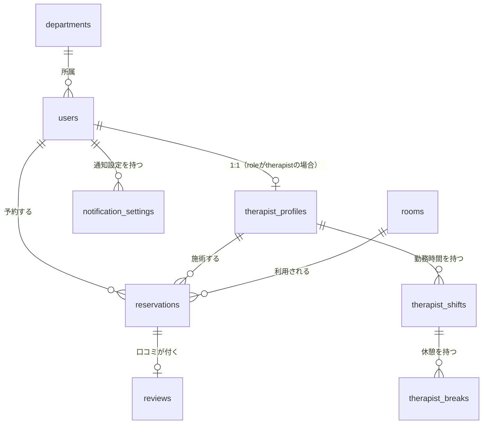

# マッサージ室予約アプリ ― データベース設計・認証方式

これまでのヒアリング内容・確定した機能一覧・画面モックアップ（予約の二重登録防止、匿名性ルール、口コミ機能など）を踏まえ、認証方式とデータベース設計を以下のとおり決定する。

本アプリは本番環境への導入は行わない前提（Tech Jam向けのプロトタイプ）のため、実在の社内システムとの連携は行わず、認証・データはすべてこのアプリ自身が持つ簡易なデータベースで完結させる。

---

## 1. 認証方式

### 1.1 結論

| 項目 | 決定内容 |
|---|---|
| 認証方式 | **社員ID・パスワードによるログイン** |
| パスワード保存 | **bcrypt** でハッシュ化 |
| セッション | **Cookie** |

### 1.2 ログインの仕組み

パスワードは **bcrypt** でハッシュ化して保存する。平文保存・可逆暗号化は行わない。

### 1.3 セッション管理

セッションは **Cookie** で管理する。

---

## 2. データベース設計

### 2.1 DBMS

**PostgreSQL** を採用する。理由：予約の二重登録防止に、範囲型（`tsrange`）と排他制約（`EXCLUDE USING gist`）が使え、アプリケーションコードに頼らずDB自身が同時実行時の重複を防げるため（§2.4）。MySQL等でも実現は可能だがトリガーの自作が必要になり複雑化する。

### 2.2 ER図（概要）



### 2.3 テーブル定義

#### `departments`（部署）
| column | type | note |
|---|---|---|
| id | uuid PK | |
| name | text, NOT NULL | 開発部／営業部／総務部／その他 |

#### `users`（利用者・マッサージ師・管理者 共通）
| column | type | note |
|---|---|---|
| id | uuid PK | |
| employee_code | text, unique, NOT NULL | 社員ID（ログインに使用） |
| name | text, NOT NULL | |
| email | text, unique, nullable | ログインには使用しないため null を許可 |
| department_id | uuid FK → departments, nullable | |
| role | enum(`user`,`therapist`,`admin`), NOT NULL | |
| gender | enum(`male`,`female`,`unspecified`), NOT NULL | 属性比較・マッサージ師の性別表示に使用 |
| age_bracket | enum(`20s`,`30s`,`40s`,`50s_plus`), nullable | 生年月日そのものは保持しない。属性比較機能に必要な粒度のみ保持し、個人特定性を下げる（プライバシー最小化） |
| password_hash | text, NOT NULL | bcryptハッシュ |
| is_active | boolean, NOT NULL, default true | アカウントが有効かどうか（退職時等に false） |
| created_at / updated_at | timestamptz, NOT NULL | |

#### `therapist_profiles`（マッサージ師属性）
| column | type | note |
|---|---|---|
| id | uuid PK | |
| user_id | uuid FK → users, unique, NOT NULL | |
| specialties | text[], nullable | 得意分野（肩こり・腰痛 等） |
| bio | text, nullable | 経歴（施術歴・前職・保有資格など） |
| photo_url | text, nullable | |
| is_active | boolean, NOT NULL, default true | マッサージ師として稼働中かどうか（休職中等に false） |

#### `therapist_shifts`（勤務時間登録）
| column | type | note |
|---|---|---|
| id | uuid PK | |
| therapist_id | uuid FK → therapist_profiles, NOT NULL | |
| work_date | date, NOT NULL | |
| start_time | time, NOT NULL | |
| end_time | time, NOT NULL | |
| created_at / updated_at | timestamptz, NOT NULL | |
| 制約 | UNIQUE(therapist_id, work_date) | 1日1レンジ。休憩は別テーブルで表現 |

#### `therapist_breaks`（休憩時間）
| column | type | note |
|---|---|---|
| id | uuid PK | |
| shift_id | uuid FK → therapist_shifts, NOT NULL | |
| break_start | time, NOT NULL | |
| break_end | time, NOT NULL | |
| kind | text, NOT NULL DEFAULT 'break' | `break`（休憩）/ `unavailable`（その他・施術不可）。シフト範囲内の一区間が空いていない理由を区別する |
| label | text, NULL可 | `kind='unavailable'`のときの自由記述の理由（例:「外出」「研修」）。任意入力 |

#### `rooms`（施術室）
| column | type | note |
|---|---|---|
| id | uuid PK | |
| name | text, NOT NULL | ベッドA／ベッドB／ベッドC |

#### `reservations`（予約） ※最重要テーブル
| column | type | note |
|---|---|---|
| id | uuid PK | |
| user_id | uuid FK → users, NOT NULL | |
| therapist_id | uuid FK → therapist_profiles, NOT NULL | |
| room_id | uuid FK → rooms, nullable | 空いている部屋を予約時に自動割当 |
| reservation_date | date, NOT NULL | |
| start_time | time, NOT NULL | |
| end_time | time, NOT NULL | 1〜45分の範囲。start_timeとの差分がduration |
| requested_note | text, nullable | 施術部位・伝えたいこと |
| status | enum(`confirmed`,`cancelled`,`completed`,`no_show`), NOT NULL, default `confirmed` | |
| cancelled_at | timestamptz, nullable | |
| cancel_reason | text, nullable | |
| created_at / updated_at | timestamptz, NOT NULL | |

#### `reviews`（口コミ）
| column | type | note |
|---|---|---|
| id | uuid PK | |
| reservation_id | uuid FK → reservations, unique, NOT NULL | 1予約につき1件まで |
| rating | smallint, NOT NULL, CHECK (rating BETWEEN 1 AND 5) | |
| comment | text, nullable | |
| created_at | timestamptz, NOT NULL | |

匿名性：`reviews`自体に`user_id`は持たせない。`reservation_id`経由でのみ投稿者を辿れる構造にし、マッサージ師管理画面向けAPIは`reservations.user_id → users.department_id → departments.name`のみを解決して返す（氏名・メールは返さない）。

#### `notification_settings`（通知設定）
| column | type | note |
|---|---|---|
| id | uuid PK | |
| user_id | uuid FK → users, NOT NULL | |
| channel | enum(`in_app`,`email`,`slack`), NOT NULL | |
| enabled | boolean, NOT NULL, default true | |
| minutes_before | int, NOT NULL | 既定値：利用者30分／マッサージ師10分 |
| slack_user_id | text, nullable | |

### 2.4 二重予約防止（最重要制約）

「空き状況の確認」と「予約の確定」の間には必ず競合状態（race condition）が起こり得るため、**アプリケーションコードでのチェックだけに頼らず、DB制約で機械的にブロックする**。

```sql
-- 同一マッサージ師の予約時間帯が重複することをDBレベルで禁止
ALTER TABLE reservations ADD CONSTRAINT no_overlap_per_therapist
EXCLUDE USING gist (
  therapist_id WITH =,
  tsrange(
    (reservation_date + start_time)::timestamp,
    (reservation_date + end_time)::timestamp,
    '[)'
  ) WITH &&
) WHERE (status = 'confirmed');

-- ベッドは3床しかないため、ベッドの二重利用も同様に防止
ALTER TABLE reservations ADD CONSTRAINT no_overlap_per_room
EXCLUDE USING gist (
  room_id WITH =,
  tsrange(
    (reservation_date + start_time)::timestamp,
    (reservation_date + end_time)::timestamp,
    '[)'
  ) WITH &&
) WHERE (status = 'confirmed' AND room_id IS NOT NULL);
```

`WHERE (status = 'confirmed')` により、キャンセル済み予約は制約の対象外になる（同じ枠への再予約を妨げない）。この制約は `btree_gist` 拡張（`CREATE EXTENSION btree_gist;`）を要する。

実際にPostgreSQLでこの制約を作成し、(A)同一マッサージ師への重複時間帯の予約が拒否されること、(B)隣接する時間帯（例：12:00-12:45の直後の12:45-13:15）は正常に登録できること、(C)予約をキャンセルすれば同じ枠に再予約できること、の3パターンを実データで検証済み。

### 2.5 インデックス方針

- `reservations(therapist_id, reservation_date)`、`reservations(user_id, reservation_date)` に複合インデックス（カレンダー表示・履歴表示の高速化）。
- `reservations(reservation_date, status)` に複合インデックス（利用率ダッシュボードの集計用）。
- 将来的にデータ量が増えた場合は、日次バッチで `utilization_daily_stats`（施術者ID・日付・稼働分・空き分を事前集計したテーブル）を作成し、ダッシュボードはそこから読む方式に切り替える（生ログへの都度集計を避ける）。

---

## 3. 匿名性ルールの実装方針（再掲・詳細）

要件：「利用者は『埋まっている時間』は見えるが、誰が予約したかは見えない（匿名）。マッサージ師は全利用者の名前と予約内容が見える。」

**実装方針：DBは常にフルデータを保持し、マスキングや削除は行わない**（管理者の対応・監査のため）。「誰に見せるか」はAPI層のレスポンス整形だけで制御する。

- 利用者ロール向け（例：`GET /reservations/calendar`）：他人の予約は `{ date, start_time, end_time, status: "booked" }` のみを返し、`user_id`・氏名は一切含めない。
- マッサージ師ロール向け：自分が担当する予約は `user`の氏名・`requested_note`を含め全項目を返す。
- 管理者ロール向け「口コミ」API：`reviews` → `reservations.user_id` → `users.department_id` → `departments.name` の経路のみ解決し、氏名・メールアドレスは返さない（マッサージ師管理画面の「投稿者は所属部署のみ表示」という要件どおり）。

---

## 4. 検討して不採用にした案（参考）

| 案 | 不採用の理由 |
|---|---|
| NoSQL（Firestore等） | 予約の二重登録防止に必要な排他制約・外部キー整合性を、RDBMSほど確実には担保できないため |

---

## 5. テストアカウント

`mock-db/build_mock_directory.py` を実行すると、実際にこのスキーマを構築し、画面モックアップに登場する人物と対応するテストアカウントを投入できる（`mock-db/mock_directory.sqlite3`）。

| 社員ID | 氏名 | ロール | 部署 |
|---|---|---|---|
| E1001 | 佐々木 美咲 | user（利用者） | 開発部 |
| E1002 | 山田 洋輔 | user（利用者） | 総務部 |
| E1003 | 高橋 直人 | user（利用者） | 営業部 |
| T2001 | 田中 仁 | therapist（マッサージ師） | ― |
| T2002 | 木村 健 | therapist（マッサージ師） | ― |
| T2003 | 高橋 大輔 | therapist（マッサージ師） | ― |
| T2004 | 佐藤 香 | therapist（マッサージ師） | ― |
| A3001 | 鈴木 一郎 | admin（管理者） | 総務部 |

全アカウント共通のテスト用パスワードは **`Passw0rd!`**（bcryptでハッシュ化してDBに保存。平文はDBには入れていない）。テスト用の資格情報は別ファイル（`mock-db/test-credentials.md`）にまとめている。

投入した全8アカウントに対して実際に `bcrypt.checkpw()` でログイン相当の検証を行い、正しいパスワードでは全件成功・誤ったパスワードでは失敗することを確認済み。

```
E1001    佐々木 美咲     user       OK
E1002    山田 洋輔      user       OK
E1003    高橋 直人      user       OK
T2001    田中 仁       therapist  OK
T2002    木村 健       therapist  OK
T2003    高橋 大輔      therapist  OK
T2004    佐藤 香       therapist  OK
A3001    鈴木 一郎      admin      OK
8/8 件のアカウントでログイン検証が成功しました。
誤ったパスワードでの検証(false になるべき): False
```

---

## 6. 決定事項まとめ

| 項目 | 決定内容 |
|---|---|
| 認証 | 社員ID・パスワードによるログイン（bcryptハッシュ） |
| セッション | Cookie |
| DBMS | PostgreSQL |
| 二重予約防止 | `EXCLUDE USING gist`（`tsrange`）を`therapist_id`・`room_id`双方に設定 |
| 匿名性 | DBはフルデータ保持、API層のシリアライザでロール別に出し分け |
| 口コミ | `reservations`に1:1で紐付け、表示は投稿者の所属部署名のみ（氏名非表示） |
| 年代属性 | 生年月日ではなく`age_bracket`（20代/30代/40代/50代以上）のみ保持 |
| users.email | ログインに使わないため null を許可 |
| users.is_active | 旧`status`（enum）から変更。boolean で管理 |
| テストアカウント | `mock-db/`一式で8アカウント（利用者3・マッサージ師4・管理者1）を用意 |
